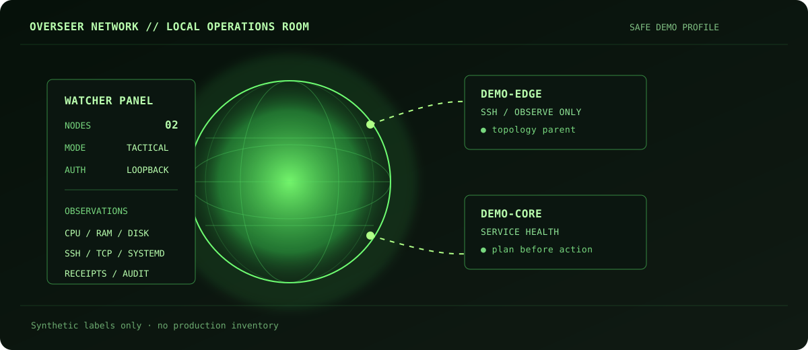
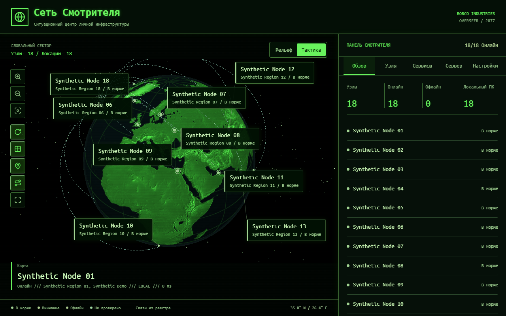
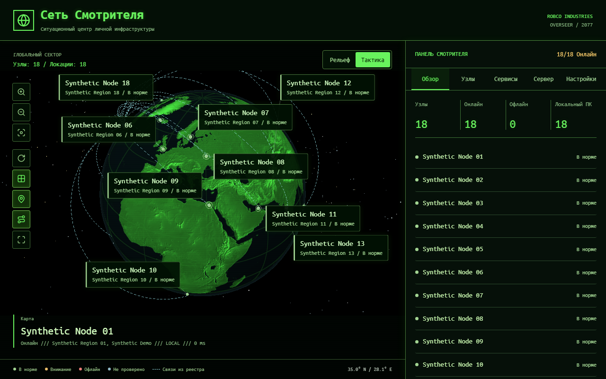
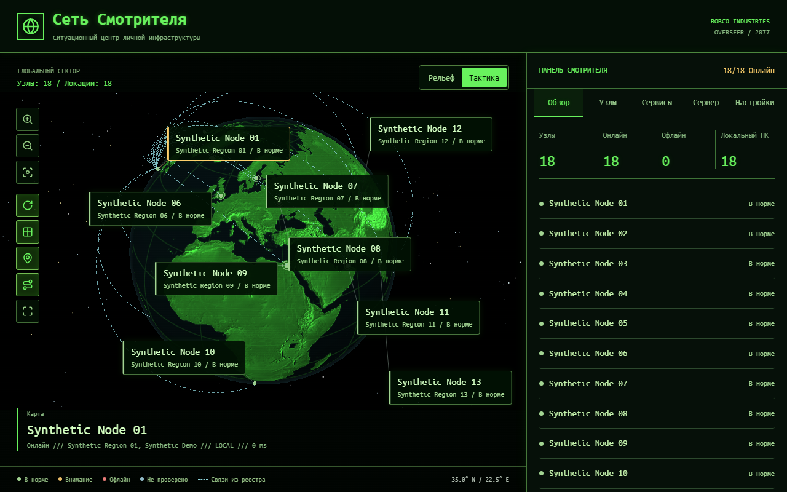
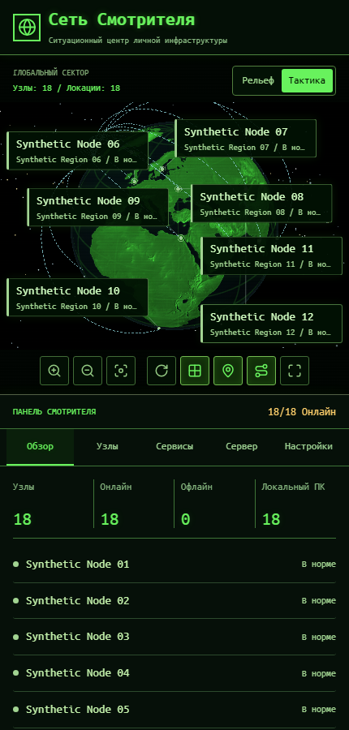

# Overseer Network

  

<strong>Локальный ситуационный центр для личной инфраструктуры</strong> 
SSH-узлы, службы, метрики, топология и контролируемые операции в одном web-интерфейсе.

  <a href="README.en.md">English version</a> ·
  <a href="docs/management-api.md">API contract</a> ·
  <a href="LICENSE">MIT License</a>

  <code>Python 3.11+</code> · <code>FastAPI</code> · <code>SSH</code> · <code>systemd / Docker</code>

Overseer Network — это single-user control plane для наблюдения за собственной инфраструктурой. Панель показывает состояние узлов на 3D-глобусе, собирает ограниченный набор метрик, открывает SSH-терминал и проводит разрешённые операции через план с явным подтверждением.

Репозиторий содержит только код, документацию, тесты и обезличенный пример. Реестр серверов, ключи, токены, логи, базы данных и экспорты намеренно не входят в публичную копию.

## Возможности

| Область | Что есть |
| --- | --- |
| Наблюдение | Состояние SSH-узлов, CPU/RAM/диск, задержка и ошибки подключения |
| Топология | 3D-карта, физические точки, связи между узлами, режимы «Рельеф» и «Тактика» |
| Управление | systemd и Docker, шаблоны сервисов, проверка SSH и отпечатка host key |
| Безопасные операции | План перед действием, защита production/protected-сервисов, durable receipt и повторная сверка |
| Интерфейс | Русский и английский UI, Fallout-inspired и нейтральная operational-тема, адаптивная вёрстка |
| API | Небольшой authenticated API для автоматизации без встраивания личного инвентаря в код |

## Быстрый старт

Нужен Python 3.11+.

~~~
python -m venv venv
.\venv\Scripts\python.exe -m pip install -r requirements.txt
.\venv\Scripts\python.exe -m app --open
~~~

Панель откроется только на <code>http://127.0.0.1:2077</code>. Порт меняется параметром <code>--port</code>. На Windows также доступны команды фонового launcher:

~~~
.\overseer.cmd open
.\overseer.cmd status
.\overseer.cmd stop
~~~

Первый запуск стартует с пустым реестром. Узлы добавляются через UI; исходный SSH-ключ остаётся на машине backend и не копируется в проект.

### Безопасный demo-пример

В [examples/demo/servers.yaml](examples/demo/servers.yaml) находятся только синтетические адреса и координаты. Чтобы открыть его отдельно от рабочего инвентаря:

~~~
$env:OVERSEER_HOME = (Resolve-Path .\examples\demo).Path
.\venv\Scripts\python.exe -m app --open --port 2078
~~~

Demo-файл предназначен для знакомства со схемой данных; он не обещает доступность узлов и не содержит credentials.

Для запуска именно обезличенной глобальной витрины укажите demo-профиль до старта панели:

~~~powershell
$env:OVERSEER_HOME = (Resolve-Path .\examples\demo-many).Path
.\venv\Scripts\python.exe -m app --open --port 2078
~~~

## Обезличенная демонстрация интерфейса

Ниже — кадры настоящего web-интерфейса Overseer Network, запущенного с безопасным demo-профилем: текстурный 3D-глобус, рельеф, координатная сетка, связи, поворот карты и responsive-мобильный layout. Все названия, состояния и физические точки в этих кадрах синтетические; рабочий реестр, IP-адреса, ключи и credentials не используются. Исходная 18-узловая конфигурация находится в [examples/demo-many/servers.yaml](examples/demo-many/servers.yaml); записи работают в локальном режиме, а координаты нужны только для демонстрации карты.

  
  

  
  

## Архитектура

~~~mermaid
flowchart LR
    UI["Responsive web UI map · panel · terminal"] --> API["FastAPI authenticated API"]
    API --> CFG["Validated registry atomic writes"]
    API --> OBS["Bounded observations SSH · TCP · local metrics"]
    API --> OPS["Operation planner explicit confirmation"]
    OBS --> NODES["Linux nodes systemd / Docker"]
    OPS --> NODES
~~~

| Модуль | Ответственность |
| --- | --- |
| <code>app/config.py</code>, <code>app/paths.py</code> | Схема, шаблоны, атомарная запись и расположение данных |
| <code>app/setup_api.py</code> | Первый запуск, импорт/экспорт, шаблоны и проверка SSH |
| <code>app/ssh_transport.py</code>, <code>app/remote_probe.py</code> | SSH и ограниченный сбор наблюдений |
| <code>app/fleet.py</code>, <code>app/fleet_profiles.py</code> | Кэш метрик и политика операций |
| <code>app/operations.py</code>, <code>app/fleet_api.py</code> | План, подтверждение и receipts |
| <code>app/geolocation.py</code> | IP-геолокация, физические точки и freshness |
| <code>static/js/</code>, <code>templates/</code> | Глобус, терминал и настройки отображения |

## Границы и приватность

- Это single-user control plane. Запускайте один worker и не выставляйте порт напрямую в интернет.
- Терминал имеет права настроенного SSH-пользователя; режим наблюдения не ограничивает права терминала.
- Production/protected-сервисы не перезапускаются через API. Остальные операции требуют свежего плана и явного подтверждения.
- Экспорт реестра содержит адреса, координаты и топологию. Считайте его приватным файлом.
- <code>servers.yaml</code>, <code>overseer.secrets.json</code>, <code>data/</code>, логи и сборочные артефакты исключены из Git.
- Авто-геолокация может отправить публичный IP узла в <code>ipwho.is</code>; для чувствительных узлов используйте ручные координаты.
- Three.js, xterm и шрифты подключаются с CDN; полный offline-режим пока не заявляется.

Подробные границы и модель угроз описаны в [SECURITY.md](SECURITY.md), а контракт API — в [docs/management-api.md](docs/management-api.md).

## Проверка

~~~
.\venv\Scripts\python.exe -m pip install -r requirements-dev.txt
.\venv\Scripts\python.exe -m unittest discover -s tests -v
node --test tests\*.test.cjs
.\venv\Scripts\python.exe scripts\source_bundle.py --check
~~~

Исходный бандл собирается по allowlist:

~~~
.\venv\Scripts\python.exe scripts\source_bundle.py
~~~

Скрипт не отправляет файлы в GitHub и отбрасывает локальные реестры, secrets, ключи, логи, venv и старые медиа без provenance.

## Статус

Проект активно развивается как личный инструмент. Backend и web UI уже разделены API-контрактом; native desktop/APK-пакет в этот репозиторий не входит.

## Лицензия и ресурсы

Код распространяется по [MIT](LICENSE). Лицензии и источники встроенных ресурсов собраны в [THIRD_PARTY_NOTICES.md](THIRD_PARTY_NOTICES.md). Проект не связан с правообладателями Fallout; MIT не предоставляет прав на их товарные знаки.
